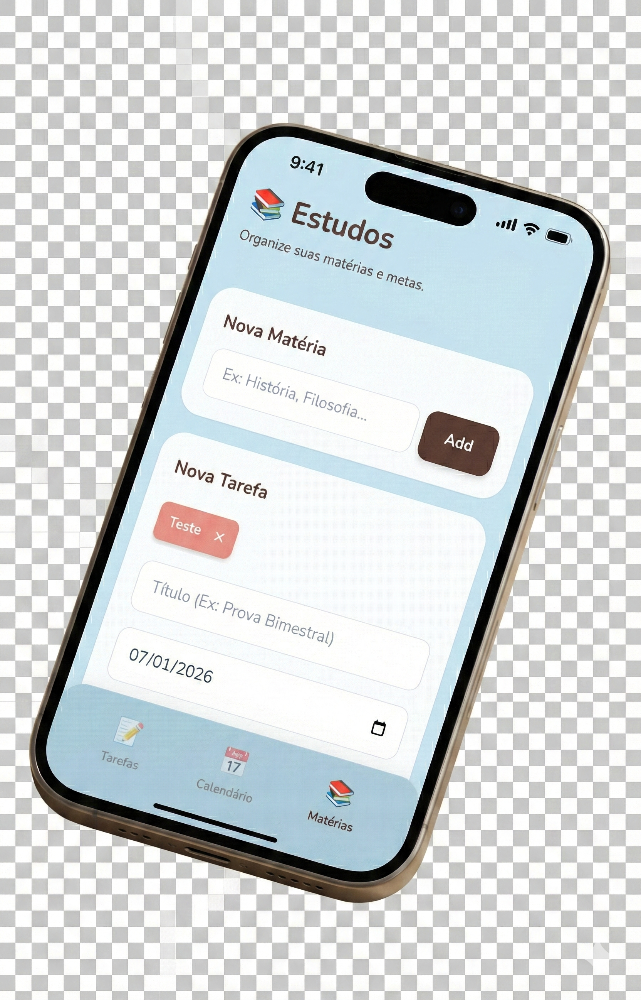

# 📚 Agenda de Estudos (Classes PWA)

Um aplicativo **PWA (Progressive Web App)** simples, leve e com visual "cozy" para organização de matérias escolares e prazos de tarefas. Desenvolvido para funcionar offline e ser instalado em dispositivos móveis e desktop.


*(Dica: Tire um print da tela do app e salve como preview.png na pasta para a imagem aparecer aqui)*

## ✨ Funcionalidades

* **Gerenciamento de Matérias:** Adicione disciplinas (ex: História, Matemática) que viram etiquetas coloridas.
* **Controle de Tarefas:** Crie tarefas vinculadas às matérias com data e tipo (Prova, Trabalho, Leitura).
* **Calendário Interativo:** Visualize seus prazos em um calendário mensal. Dias com tarefas possuem marcadores visuais.
* **Persistência de Dados:** Tudo é salvo automaticamente no seu navegador (LocalStorage). Não precisa de banco de dados.
* **Offline-First:** Funciona sem internet após o primeiro acesso.
* **Instalável:** Pode ser instalado como aplicativo nativo no Android, iOS e Desktop.

## 🛠️ Tecnologias Utilizadas

O projeto foi construído com a filosofia "Keep it Simple" (Mantenha Simples), sem necessidade de instalação de pacotes complexos (npm/node_modules).

* **HTML5 Semântico**
* **Tailwind CSS** (Via CDN) - Para estilização rápida e responsiva.
* **Vanilla JavaScript** (ES6+) - Lógica pura, sem frameworks pesados.
* **Service Workers** - Para funcionalidade PWA e cache offline.

## 🚀 Como Rodar Localmente

Sendo um projeto estático, é muito fácil rodar em qualquer computador.

### Pré-requisitos
* Um navegador moderno (Chrome, Firefox, Edge).
* Python 3 (opcional, para servidor local).

### Passo a passo (Linux/Mac)

1. Clone este repositório:
   ```bash
   git clone [https://github.com/SEU-USUARIO/agenda-estudos-pwa.git](https://github.com/SEU-USUARIO/agenda-estudos-pwa.git)
   cd agenda-estudos-pwa