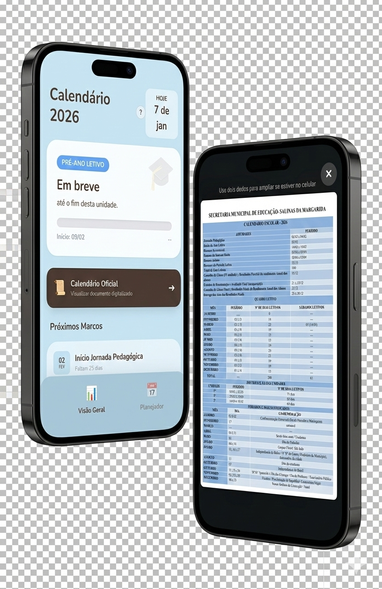

# 📅 Planejador Escolar Salinas 2026

> Uma ferramenta digital inteligente, offline e focada na realidade dos professores da rede municipal de Salinas da Margarida.


*(Visão geral do aplicativo rodando em um dispositivo móvel)*

## 📖 Sobre o Projeto

Este aplicativo foi desenvolvido para auxiliar professores a gerenciarem o tempo letivo de forma eficiente. Diferente de agendas comuns, este Planejador foi programado com a **"inteligência" do Calendário Oficial de 2026 de Salinas da Margarida**.

Ele já "sabe" quando são os feriados municipais (como o Dia do Pescador e a Emancipação), os recessos longos (Junino) e as datas de início e fim de cada Unidade.

## ✨ Funcionalidades Principais

### 1. Visão Geral (Dashboard)
* **Monitoramento de Unidade:** Mostra automaticamente em qual das 3 Unidades Letivas estamos.
* **Barra de Progresso:** Uma visualização gráfica de quanto tempo falta para o fim da unidade, ajudando o professor a dosar o ritmo do conteúdo.
* **Próximos Marcos:** Avisa sobre eventos críticos futuros (Ex: Entrega de Atas, Início do Recesso Junino).

### 2. Calculadora de Aulas Reais
A ferramenta de trabalho pesado do professor.
* **Como funciona:** Você seleciona os dias da semana que leciona (ex: Terças e Quintas).
* **O Cálculo:** O sistema varre o ano de 2026 inteiro e gera uma lista de datas letivas, **descontando automaticamente**:
    * Feriados Nacionais e Municipais.
    * Semana Santa e Carnaval.
    * O Recesso Junino (19/06 a 02/07).
* **Sábado Letivo:** Inclui automaticamente o sábado letivo de 14/03 se necessário.

### 3. Consulta Oficial
* Acesso rápido à imagem digitalizada do Calendário Oficial da Prefeitura, para tirar dúvidas e conferir a "fonte da verdade".

---

## 📲 Como Instalar (PWA)

Este é um **Progressive Web App (PWA)**. Isso significa que ele é um site que se comporta como um aplicativo nativo. Ele não ocupa espaço na memória e funciona **sem internet** (Offline).

### No Android
1.  Acesse o link do projeto.
2.  Toque em **"Instalar App"** (se aparecer no topo) ou vá no menu do navegador (três pontinhos) e selecione **"Adicionar à tela inicial"**.

### No iPhone (iOS)
1.  Abra no Safari.
2.  Toque no botão **Compartilhar** (quadrado com seta para cima).
3.  Role para baixo e escolha **"Adicionar à Tela de Início"**.

### No Computador (Linux/Windows)
1.  Abra no Chrome ou Edge.
2.  Clique no ícone de **Computador com uma seta** que aparece na barra de endereço (lado direito).

---

## 🛠️ Tecnologias e Execução Local

O projeto segue a filosofia "Keep it Simple" (Simplicidade), rodando sem necessidade de bancos de dados complexos.

* **Linguagens:** HTML5, Tailwind CSS (Estilo), Vanilla JavaScript (Lógica).
* **Armazenamento:** LocalStorage (Salva seus dados no próprio navegador).
* **Offline:** Service Workers (Cache inteligente).

### Para rodar no seu computador (Linux/Mac):

1.  Baixe os arquivos deste repositório.
2.  Abra o terminal na pasta.
3.  Execute um servidor simples Python:
    ```bash
    python3 -m http.server
    ```
4.  Abra o navegador em: `http://localhost:8000`

---

## 👨‍🏫 Autor

Desenvolvido por **Sérgio**.
*Professor, Escritor e Pesquisador da História de Salinas da Margarida.*

---
*Este software é livre e de código aberto, feito para fortalecer a educação.*